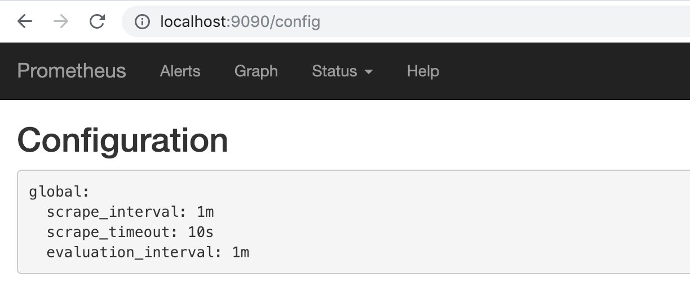

# 使用Operator管理Prometheus

## 创建Prometheus实例

当集群中已经安装Prometheus Operator之后，对于部署Prometheus Server实例就变成了声明一个Prometheus资源，如下所示，我们在Monitoring命名空间下创建一个Prometheus实例：

```
apiVersion: monitoring.coreos.com/v1
kind: Prometheus
metadata:
  name: inst
  namespace: monitoring
spec:
  resources:
    requests:
      memory: 400Mi
```

将以上内容保存到prometheus-inst.yaml文件，并通过kubectl进行创建：

```
$ kubectl create -f prometheus-inst.yaml
prometheus.monitoring.coreos.com/inst-1 created
```

此时，查看default命名空间下的statefulsets资源，可以看到Prometheus Operator自动通过Statefulset创建的Prometheus实例：

```
$ kubectl -n monitoring get statefulsets
NAME              DESIRED   CURRENT   AGE
prometheus-inst   1         1         1m
```

查看Pod实例：

```
$ kubectl -n monitoring get pods
NAME                                   READY     STATUS    RESTARTS   AGE
prometheus-inst-0                      3/3       Running   1          1m
prometheus-operator-6db8dbb7dd-2hz55   1/1       Running   0          45m
```

通过port-forward访问Prometheus实例:

```
$ kubectl -n monitoring port-forward statefulsets/prometheus-inst 9090:9090
```

通过[http://localhost:9090](http://localhost:9090)可以在本地直接打开Prometheus Operator创建的Prometheus实例。查看配置信息，可以看到目前Operator创建了只包含基本配置的Prometheus实例：




## 使用ServiceMonitor管理监控配置

修改监控配置项也是Prometheus下常用的运维操作之一，为了能够自动化的管理Prometheus的配置，Prometheus Operator使用了自定义资源类型ServiceMonitor来描述监控对象的信息。

这里我们首先在集群中部署一个示例应用，将以下内容保存到example-app.yaml，并使用kubectl命令行工具创建：

```
kind: Service
apiVersion: v1
metadata:
  name: example-app
  labels:
    app: example-app
spec:
  selector:
    app: example-app
  ports:
  - name: web
    port: 8080
---
apiVersion: extensions/v1beta1
kind: Deployment
metadata:
  name: example-app
spec:
  replicas: 3
  template:
    metadata:
      labels:
        app: example-app
    spec:
      containers:
      - name: example-app
        image: fabxc/instrumented_app
        ports:
        - name: web
          containerPort: 8080
```

示例应用会通过Deployment创建3个Pod实例，并且通过Service暴露应用访问信息。

```
$ kubectl get pods
NAME                        READY     STATUS    RESTARTS   AGE
example-app-94c8bc8-l27vx   2/2       Running   0          1m
example-app-94c8bc8-lcsrm   2/2       Running   0          1m
example-app-94c8bc8-n6wp5   2/2       Running   0          1m
```

在本地同样通过port-forward访问任意Pod实例

```
$ kubectl port-forward deployments/example-app 8080:8080
```

访问本地的[http://localhost:8080/metrics](http://localhost:8080/metrics)实例应用程序会返回以下样本数据：

```
# TYPE codelab_api_http_requests_in_progress gauge
codelab_api_http_requests_in_progress 3
# HELP codelab_api_request_duration_seconds A histogram of the API HTTP request durations in seconds.
# TYPE codelab_api_request_duration_seconds histogram
codelab_api_request_duration_seconds_bucket{method="GET",path="/api/bar",status="200",le="0.0001"} 0
```

为了能够让Prometheus能够采集部署在Kubernetes下应用的监控数据，在原生的Prometheus配置方式中，我们在Prometheus配置文件中定义单独的Job，同时使用kubernetes_sd定义整个服务发现过程。而在Prometheus Operator中，则可以直接生命一个ServiceMonitor对象，如下所示：

```
apiVersion: monitoring.coreos.com/v1
kind: ServiceMonitor
metadata:
  name: example-app
  namespace: monitoring
  labels:
    team: frontend
spec:
  namespaceSelector:
    matchNames:
    - default
  selector:
    matchLabels:
      app: example-app
  endpoints:
  - port: web
```

通过定义selector中的标签定义选择监控目标的Pod对象，同时在endpoints中指定port名称为web的端口。默认情况下ServiceMonitor和监控对象必须是在相同Namespace下的。在本示例中由于Prometheus是部署在Monitoring命名空间下，因此为了能够关联default命名空间下的example对象，需要使用namespaceSelector定义让其可以跨命名空间关联ServiceMonitor资源。保存以上内容到example-app-service-monitor.yaml文件中，并通过kubectl创建：

```
$ kubectl create -f example-app-service-monitor.yaml
servicemonitor.monitoring.coreos.com/example-app created
```

如果希望ServiceMonitor可以关联任意命名空间下的标签，则通过以下方式定义：

```
spec:
  namespaceSelector:
    any: true
```

Prometheus与ServiceMonitor之间的关联关系使用serviceMonitorSelector定义，在Prometheus中通过标签选择当前需要监控的ServiceMonitor对象。修改prometheus-inst.yaml中Prometheus的定义如下所示：
为了能够让Prometheus关联到ServiceMonitor，需要在Pormtheus定义中使用serviceMonitorSelector，我们可以通过标签选择当前Prometheus需要监控的ServiceMonitor对象。修改prometheus-inst.yaml中Prometheus的定义如下所示：

```
apiVersion: monitoring.coreos.com/v1
kind: Prometheus
metadata:
  name: inst
  namespace: monitoring
spec:
  serviceMonitorSelector:
    matchLabels:
      team: frontend
  resources:
    requests:
      memory: 400Mi
```

将对Prometheus的变更应用到集群中：

```
$ kubectl -n monitoring apply -f prometheus-inst.yaml
```

此时，如果查看Prometheus配置信息，我们会惊喜的发现Prometheus中配置文件自动包含了一条名为monitoring/example-app/0的Job配置：

```
global:
  scrape_interval: 30s
  scrape_timeout: 10s
  evaluation_interval: 30s
  external_labels:
    prometheus: monitoring/inst
    prometheus_replica: prometheus-inst-0
alerting:
  alert_relabel_configs:
  - separator: ;
    regex: prometheus_replica
    replacement: $1
    action: labeldrop
rule_files:
- /etc/prometheus/rules/prometheus-inst-rulefiles-0/*.yaml
scrape_configs:
- job_name: monitoring/example-app/0
  scrape_interval: 30s
  scrape_timeout: 10s
  metrics_path: /metrics
  scheme: http
  kubernetes_sd_configs:
  - role: endpoints
    namespaces:
      names:
      - default
  relabel_configs:
  - source_labels: [__meta_kubernetes_service_label_app]
    separator: ;
    regex: example-app
    replacement: $1
    action: keep
  - source_labels: [__meta_kubernetes_endpoint_port_name]
    separator: ;
    regex: web
    replacement: $1
    action: keep
  - source_labels: [__meta_kubernetes_endpoint_address_target_kind, __meta_kubernetes_endpoint_address_target_name]
    separator: ;
    regex: Node;(.*)
    target_label: node
    replacement: ${1}
    action: replace
  - source_labels: [__meta_kubernetes_endpoint_address_target_kind, __meta_kubernetes_endpoint_address_target_name]
    separator: ;
    regex: Pod;(.*)
    target_label: pod
    replacement: ${1}
    action: replace
  - source_labels: [__meta_kubernetes_namespace]
    separator: ;
    regex: (.*)
    target_label: namespace
    replacement: $1
    action: replace
  - source_labels: [__meta_kubernetes_service_name]
    separator: ;
    regex: (.*)
    target_label: service
    replacement: $1
    action: replace
  - source_labels: [__meta_kubernetes_pod_name]
    separator: ;
    regex: (.*)
    target_label: pod
    replacement: $1
    action: replace
  - source_labels: [__meta_kubernetes_service_name]
    separator: ;
    regex: (.*)
    target_label: job
    replacement: ${1}
    action: replace
  - separator: ;
    regex: (.*)
    target_label: endpoint
    replacement: web
    action: replace
```

不过，如果细心的读者可能会发现，虽然Job配置有了，但是Prometheus的Target中并没包含任何的监控对象。查看Prometheus的Pod实例日志，可以看到如下信息：

```
level=error ts=2018-12-15T12:52:48.452108433Z caller=main.go:240 component=k8s_client_runtime err="github.com/prometheus/prometheus/discovery/kubernetes/kubernetes.go:300: Failed to list *v1.Endpoints: endpoints is forbidden: User \"system:serviceaccount:monitoring:default\" cannot list endpoints in the namespace \"default\""
```

## 自定义ServiceAccount

由于默认创建的Prometheus实例使用的是monitoring命名空间下的default账号，该账号并没有权限能够获取default命名空间下的任何资源信息。

为了修复这个问题，我们需要在Monitoring命名空间下为创建一个名为Prometheus的ServiceAccount，并且为该账号赋予相应的集群访问权限。

```
apiVersion: v1
kind: ServiceAccount
metadata:
  name: prometheus
  namespace: monitoring
---
apiVersion: rbac.authorization.k8s.io/v1beta1
kind: ClusterRole
metadata:
  name: prometheus
rules:
- apiGroups: [""]
  resources:
  - nodes
  - services
  - endpoints
  - pods
  verbs: ["get", "list", "watch"]
- apiGroups: [""]
  resources:
  - configmaps
  verbs: ["get"]
- nonResourceURLs: ["/metrics"]
  verbs: ["get"]
---
apiVersion: rbac.authorization.k8s.io/v1beta1
kind: ClusterRoleBinding
metadata:
  name: prometheus
roleRef:
  apiGroup: rbac.authorization.k8s.io
  kind: ClusterRole
  name: prometheus
subjects:
- kind: ServiceAccount
  name: prometheus
  namespace: monitoring
```

将以上内容保存到prometheus-rbac.yaml文件中，并且通过kubectl创建相应资源：

```
$ kubectl -n monitoring create -f prometheus-rbac.yaml
serviceaccount/prometheus created
clusterrole.rbac.authorization.k8s.io/prometheus created
clusterrolebinding.rbac.authorization.k8s.io/prometheus created
```

在完成ServiceAccount创建后，修改prometheus-inst.yaml，并添加ServiceAccount如下所示：

```
apiVersion: monitoring.coreos.com/v1
kind: Prometheus
metadata:
  name: inst
  namespace: monitoring
spec:
  serviceAccountName: prometheus
  serviceMonitorSelector:
    matchLabels:
      team: frontend
  resources:
    requests:
      memory: 400Mi
```

保存Prometheus变更到集群中：

```
$ kubectl -n monitoring apply -f prometheus-inst.yaml
prometheus.monitoring.coreos.com/inst configured
```

等待Prometheus Operator完成相关配置变更后，此时查看Prometheus，我们就能看到当前Prometheus已经能够正常的采集实例应用的相关监控数据了。

